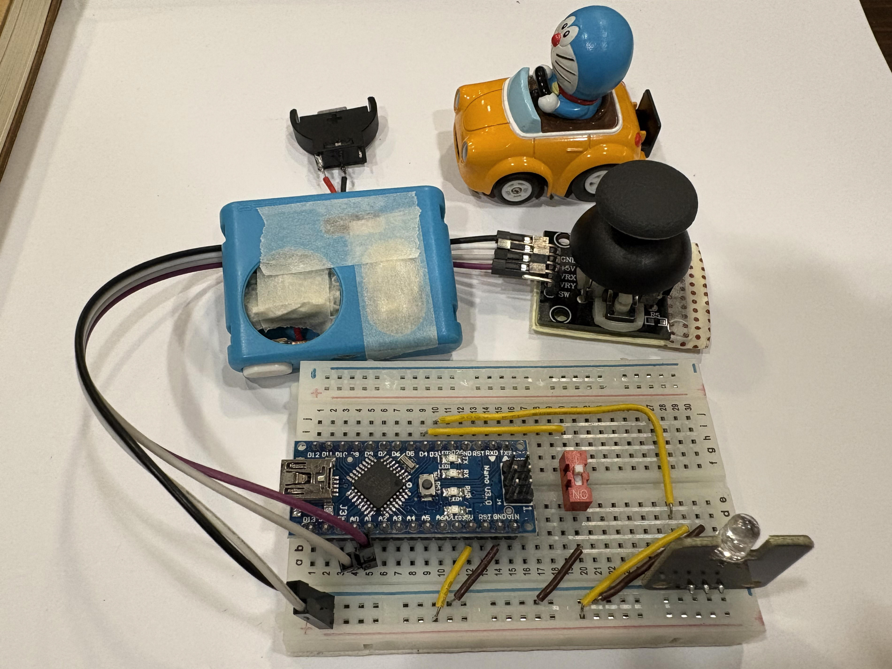
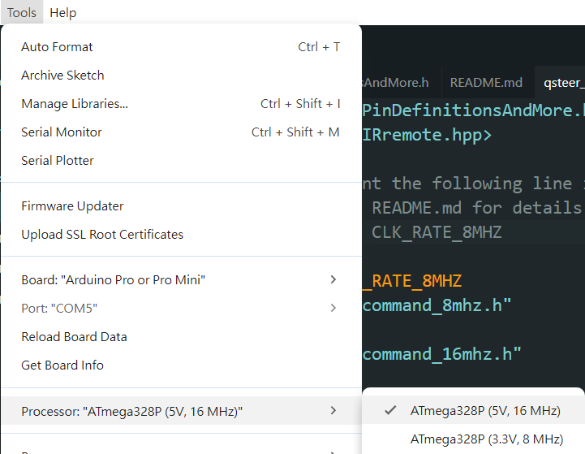

# Q-Steer RC Car Controller Emulator

This Arduino project emulates the infrared (IR) controller for the Choro Q Q-Steer RC Car Series. Control your Q-Steer car using an Arduino and IR LED, replicating the original remote's commands.

## Features

- Emulates all standard and turbo movement commands (forward, backward, left, right, diagonals, turbo modes)
- Supports multiple frequency bands (A, B, C, D)
- Two modes: Joystick and Button

## Hardware

- Arduino board (tested: Uno R3, Nano)
- IR LED
- For **Joystick mode**: 2-axis joystick module, 1x push button (turbo)
- For **Button mode**: 5x push buttons (direction + turbo)

## Pinout

### Joystick Mode (`qsteer_rc.ino`)

- **A0**: X axis (left/right)
- **A1**: Y axis (forward/backward)
- **D3** (Uno): IR LED (check `PinDefinitionsAndMore.h` or IRremote docs for other boards)
- **D4**: Turbo button

### Button Mode (`qsteer_rc_btn.ino`)

- **D3** (Uno): IR LED (check `PinDefinitionsAndMore.h` or IRremote docs for other boards)
- **D4**: Turbo
- **D5**: Forward
- **D6**: Backward
- **D7**: Left
- **D8**: Right

## Usage

1. Connect hardware for your chosen mode (see above).
2. Upload `qsteer_rc.ino` (joystick) **or** `qsteer_rc_btn.ino` (button) to your Arduino.
3. Point the IR LED at your Q-Steer car and control it.
4. Press and hold the turbo button for speed boost.

## Code

- `qsteer_rc.ino`: Joystick mode logic
- `qsteer_rc_btn.ino`: Button mode logic
- Uses [IRremote](https://github.com/Arduino-IRremote/Arduino-IRremote) for IR

## Customization

- Adjust analog thresholds in `to_digital()` (joystick mode)
- Change `band` variable in `setup()` to select frequency band

## Gallery

### Demo


### Prototype and Final Assembly



## Notes on MCU Clock Frequency

The [IRremote FAQ](https://github.com/Arduino-IRremote/Arduino-IRremote#minimal-cpu-clock-frequency) notes that 8 MHz AVR MCUs may have issues generating correct PWM for IR signals. The recommended fix is to enable hardware-generated PWM by `#define SEND_PWM_BY_TIMER`.

However, this method was unreliable on my 3.3V Arduino Pro Mini. As a workaround, I compiled the code for a 16 MHz clock and adjusted the IR signal timing — halving the pulse lengths and doubling the modulation frequency — which resolved the issue.

To apply this workaround on 8 MHz MCUs:

1. In your `.ino` file, uncomment:

    ```c
    #define CLK_RATE_8MHZ
    ```

2. In the Arduino IDE, select a processor variant with a **16 MHz** clock. For example:
    

## References

- [Q-Steer Wikipedia](https://en.wikipedia.org/wiki/Q-steer)
- [IRremote Arduino Library](https://github.com/Arduino-IRremote/Arduino-IRremote)
